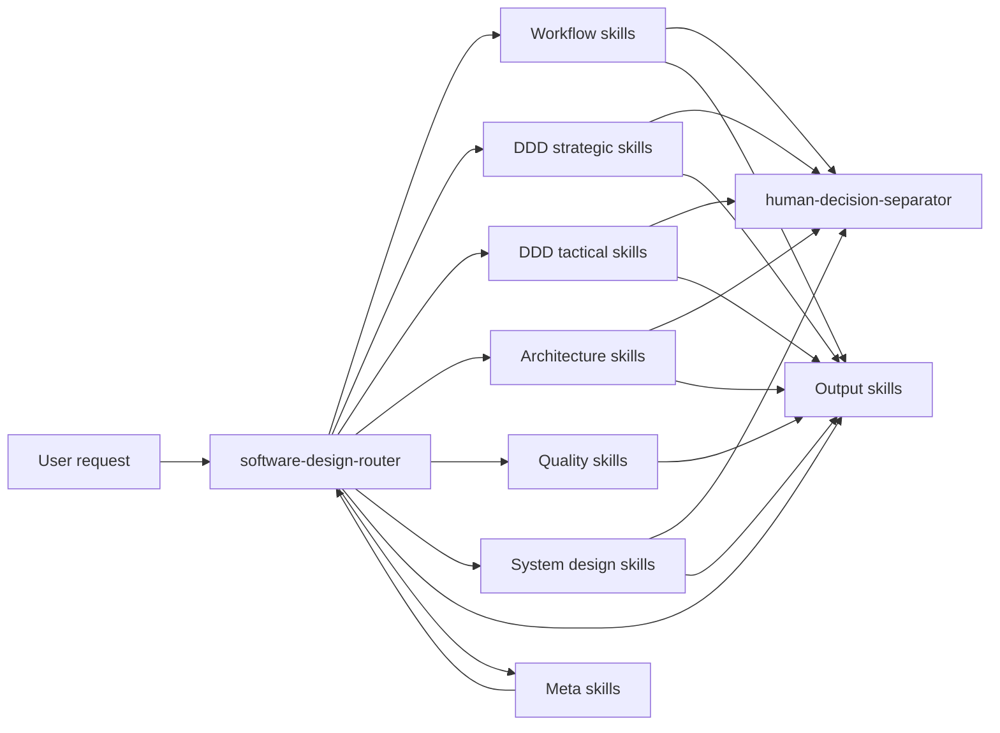
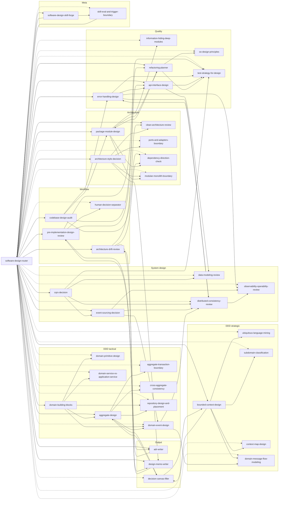
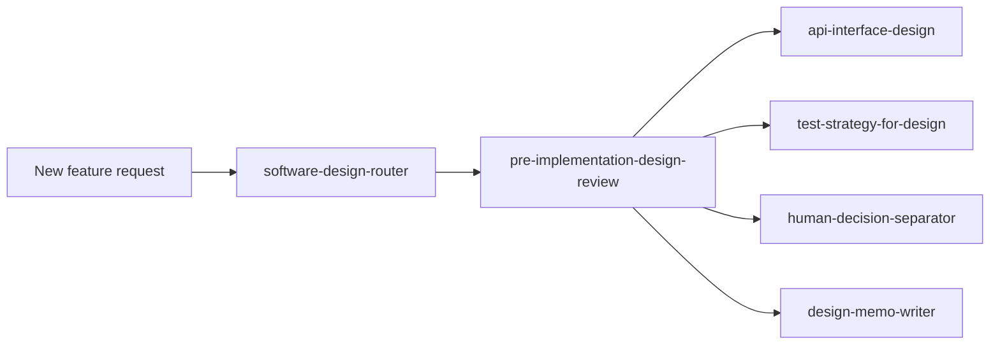
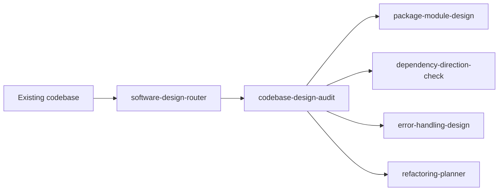
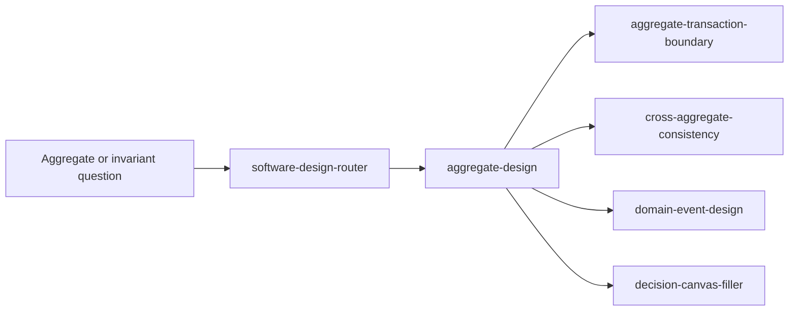
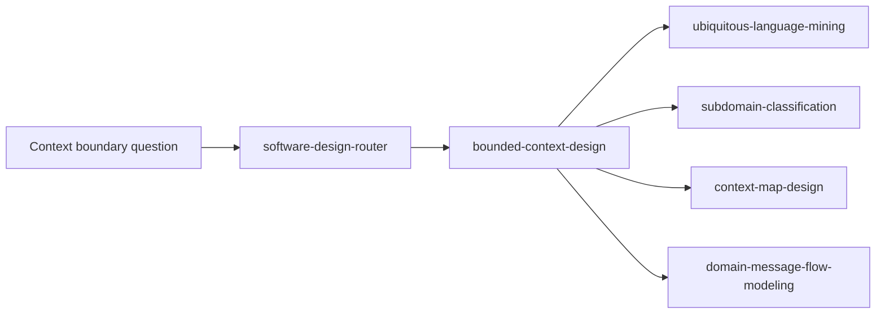
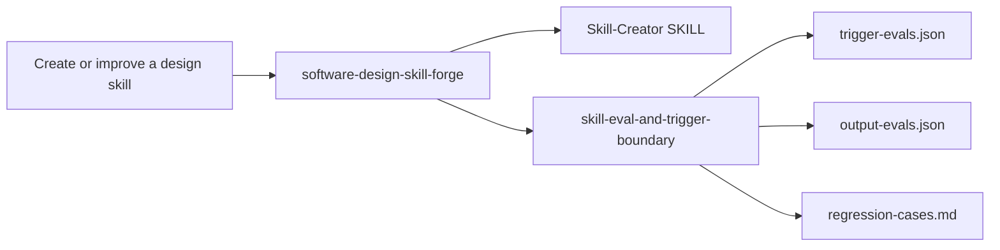

# Software Design Skill Relationship Map

This document visualizes how the Software Design skills relate to each other.

## Legend

- Solid arrows mean the source skill commonly routes to, supports, or produces input for the target skill.
- Dotted arrows from `software-design-router` mean routed or explicit specialist invocation.
- `software-design-router` is the normal entrypoint for broad or ambiguous design requests.
- Routed or explicit specialist skills usually have `policy.allow_implicit_invocation: false`.

## Category Overview

## Skill Relationship Graph

## Common Usage Flows

### New Feature Design

### Existing Codebase Audit

### DDD Aggregate Work

### Context Design

### Skill Authoring

